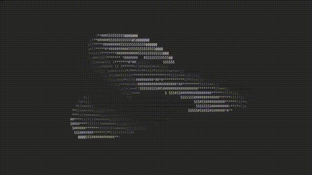
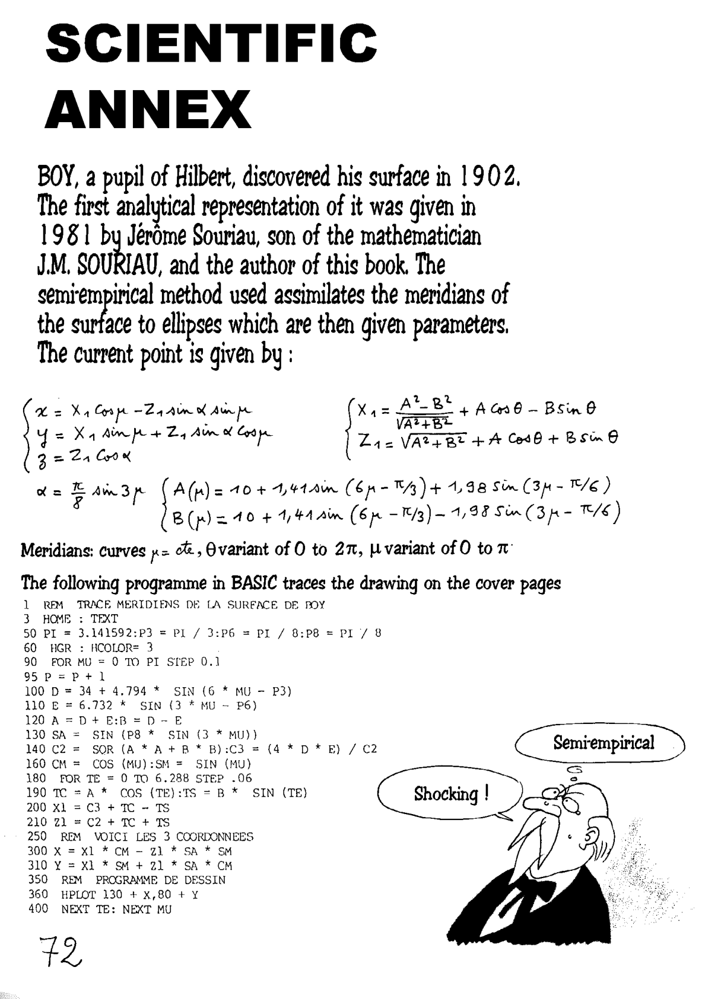

# ASCII Parametric Surface Renderer

Render smooth mathematical surfaces as animated ASCII art directly in your terminal.

This demo shows the [Boy's surface](https://en.wikipedia.org/wiki/Boy%27s_surface).

<p align="center">
    
</p>

---

## Quick Start

1. **Install prerequisites**

   ```
   pip install sympy pyyaml
   ```

2. **Run a built-in shape**

   ```
   python surface.py --shape-path shapes/torus.yaml --zoom 0.6
   ```

3. **Animate the light instead of the object**

   ```
   python surface.py --shape-path shapes/seashell.yaml --orbit-light --zoom 0.3
   ```

---

## Command-line Options

| flag             | default            | description                        |
|------------------|--------------------|------------------------------------|
| `--shape-path`   | shapes/boy.yaml    | YAML file describing the surface   |
| `--zoom`         | 0.5                | view scale                         |
| `--radial`       | 60                 | samples along the first parameter  |
| `--angular`      | 360                | samples along the second parameter |
| `--speed`        | 0.5                | horizontal rotation speed          |
| `--vspeed`       | equal to `speed`   | vertical rotation speed            |
| `--light`        | `1,1,0`            | light direction vector             |
| `--orbit-light`  | off                | orbit light instead of rotating object |
| `--no-color`     | off                | disable ANSI greyscale             |

---

## Defining New Surfaces

1. Create a YAML file in `shapes/` following the minimal pattern:

   ```yaml
   vars: [u, v]
   domain:
     u: [u_min, u_max]
     v: [v_min, v_max]
   equations: |
     x = ...
     y = ...
     z = ...
   ```

2. Run:

   ```
   python surface.py --shape-path shapes/your_shape.yaml
   ```

The full specification, allowed functions, and examples are documented in [`docs/surface-specification.md`](docs/surface-specification.md).

---

## Technical Details

A high-level description of the pipeline (YAML → SymPy → mesh → ASCII) lives in [`docs/ARCHITECTURE.md`](docs/ARCHITECTURE.md).

---

## License

MIT. Use, modify, and distribute freely. Attribution appreciated.

---

## Acknowledgements

- *donut.c* by [Andy Sloane](https://www.a1k0n.net/) for the original ASCII shading idea.  
- Paul Bourke and Wikipedia for parametric surface formulae.  
- [Ton Hospel](https://github.com/thospel), who, _years_ ago introduced me to [TOPO OF THE WORLD](https://web.archive.org/web/20160401055913/http://www.savoir-sans-frontieres.com/JPP/telechargeables/English/Topo_the_world_eng.pdf) by Jean-Pierre Petit that had math and BASIC code (on the third-to-last page) for the Boy's surface, as seen below.

<p align="center">  
  <a href="images/topo-of-the-world-page72.png">
    
  </a>
</p>

*Last updated: 2025-07-12*
